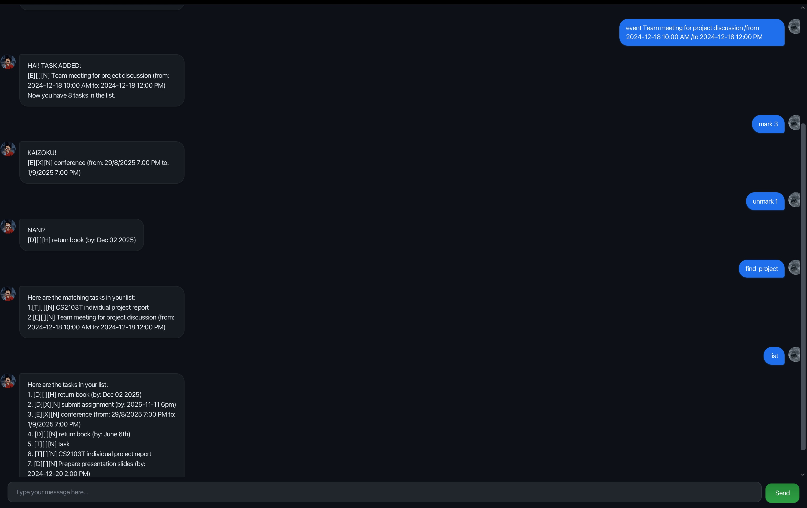

# Luffy User Guide

Luffy is a **desktop app for managing tasks, optimized for use via a Command Line Interface** (CLI) while still having the benefits of a Graphical User Interface (GUI). If you can type fast, Luffy can get your task management done faster than traditional GUI apps.

* [Quick start](#quick-start)
* [Features](#features)
  * [Adding a todo task: `todo`](#adding-a-todo-task-todo)
  * [Adding a deadline: `deadline`](#adding-a-deadline-deadline)
  * [Adding an event: `event`](#adding-an-event-event)
  * [Listing all tasks: `list`](#listing-all-tasks-list)
  * [Marking a task as done: `mark`](#marking-a-task-as-done-mark)
  * [Unmarking a task: `unmark`](#unmarking-a-task-unmark)
  * [Deleting a task: `delete`](#deleting-a-task-delete)
  * [Finding tasks: `find`](#finding-tasks-find)
  * [Checking tasks due on a date: `due`](#checking-tasks-due-on-a-date-due)
  * [Setting task priority: `priority`](#setting-task-priority-priority)
  * [Exiting the program: `bye`](#exiting-the-program-bye)
  * [Saving the data](#saving-the-data)
* [FAQ](#faq)
* [Command summary](#command-summary)

---

## Quick start

1. Ensure you have Java `17` or above installed in your computer.

2. Download the latest `Luffy.jar` file from the releases page.

3. Copy the file to the folder you want to use as the _home folder_ for your Luffy.

4. Open a command terminal, `cd` into the folder you put the jar file in, and use the `java -jar Luffy.jar` command to run the application.  
   A GUI similar to the below should appear in a few seconds. Note how the app contains a welcome message from Luffy.
   
   

5. Type the command in the command box and press Enter to execute it. e.g. typing **`list`** and pressing Enter will show all your tasks.  
   Some example commands you can try:
   * `list` : Lists all tasks.
   * `todo Read book` : Adds a todo task named "Read book" to your task list.
   * `deadline Submit report /by 2024-12-01 11:59 PM` : Adds a deadline task.
   * `delete 3` : Deletes the 3rd task shown in the current list.
   * `bye` : Exits the app.

6. Refer to the Features below for details of each command.

---

## Features

**:information_source: Notes about the command format:**

* Words in `UPPER_CASE` are the parameters to be supplied by the user.  
  e.g. in `todo DESCRIPTION`, `DESCRIPTION` is a parameter which can be used as `todo Read book`.

* Parameters must be in the specified order for the command to work correctly.

* Date and time formats supported:
  * `YYYY-MM-DD` (e.g. `2024-12-01`)
  * `YYYY-MM-DD HHMM` (e.g. `2024-12-01 1800`)
  * `YYYY-MM-DD HH:MM` (e.g. `2024-12-01 18:00`)
  * `YYYY-MM-DD H:MM AM/PM` (e.g. `2024-12-01 6:00 PM`)
  * `D/M/YYYY` (e.g. `1/12/2024`)
  * `D/M/YYYY HHMM` (e.g. `1/12/2024 1800`)
  * `D/M/YYYY HH:MM` (e.g. `1/12/2024 18:00`)
  * `D/M/YYYY H:MM AM/PM` (e.g. `1/12/2024 6:00 PM`)

* If you are using a PDF version of this document, be careful when copying and pasting commands that span multiple lines as space characters surrounding line-breaks may be omitted when copied over to the application.

### Adding a todo task: `todo`

Adds a todo task to your task list.

Format: `todo DESCRIPTION`

Examples:
* `todo Read CS2103T textbook`
* `todo Buy groceries`
* `todo Complete online course`

Expected output:
```
HAI! TASK ADDED:
[T][ ][N] Read CS2103T textbook
Now you have 1 tasks in the list.
```

### Adding a deadline: `deadline`

Adds a task with a deadline to your task list.

Format: `deadline DESCRIPTION /by DATE_TIME`

Examples:
* `deadline Submit assignment /by 2024-12-01 11:59 PM`
* `deadline Pay bills /by 15/11/2024`
* `deadline Project presentation /by 2024-11-30 14:00`

Expected output:
```
HAI! TASK ADDED:
[D][ ][N] Submit assignment (by: Dec 01 2024, 11:59 pm)
Now you have 2 tasks in the list.
```

### Adding an event: `event`

Adds an event with start and end times to your task list.

Format: `event DESCRIPTION /from START_TIME /to END_TIME`

Examples:
* `event Team meeting /from 2024-12-01 10:00 AM /to 2024-12-01 12:00 PM`
* `event Conference /from 15/11/2024 09:00 /to 15/11/2024 17:00`
* `event Workshop /from 2024-11-20 1400 /to 2024-11-20 1600`

Expected output:
```
HAI! TASK ADDED:
[E][ ][N] Team meeting (from: Dec 01 2024, 10:00 am to: Dec 01 2024, 12:00 pm)
Now you have 3 tasks in the list.
```

### Listing all tasks: `list`

Shows a list of all tasks in your task list.

Format: `list`

Expected output:
```
Here are the tasks in your list:
1. [T][ ][N] Read CS2103T textbook
2. [D][ ][N] Submit assignment (by: Dec 01 2024, 11:59 pm)
3. [E][ ][N] Team meeting (from: Dec 01 2024, 10:00 am to: Dec 01 2024, 12:00 pm)
```

### Marking a task as done: `mark`

Marks the specified task as completed.

Format: `mark INDEX`

* Marks the task at the specified `INDEX` as done.
* The index refers to the index number shown in the displayed task list.
* The index **must be a positive integer** 1, 2, 3, …​

Examples:
* `list` followed by `mark 2` marks the 2nd task in the task list as done.

Expected output:
```
KAIZOKU!
[D][X][N] Submit assignment (by: Dec 01 2024, 11:59 pm)
```

### Unmarking a task: `unmark`

Marks the specified task as not completed.

Format: `unmark INDEX`

* Marks the task at the specified `INDEX` as not done.
* The index refers to the index number shown in the displayed task list.
* The index **must be a positive integer** 1, 2, 3, …​

Examples:
* `list` followed by `unmark 2` marks the 2nd task in the task list as not done.

Expected output:
```
NANI?
[D][ ][N] Submit assignment (by: Dec 01 2024, 11:59 pm)
```

### Deleting a task: `delete`

Deletes the specified task from your task list.

Format: `delete INDEX`

* Deletes the task at the specified `INDEX`.
* The index refers to the index number shown in the displayed task list.
* The index **must be a positive integer** 1, 2, 3, …​

Examples:
* `list` followed by `delete 3` deletes the 3rd task in the task list.

Expected output:
```
HAI! TASK DELETED:
[E][ ][N] Team meeting (from: Dec 01 2024, 10:00 am to: Dec 01 2024, 12:00 pm)
Now you have 2 tasks in the list.
```

### Finding tasks: `find`

Finds tasks whose descriptions contain any of the given keywords.

Format: `find KEYWORD [MORE_KEYWORDS]`

* The search is case-insensitive. e.g `assignment` will match `Assignment`
* The order of the keywords does not matter. e.g. `CS2103T assignment` will match `assignment CS2103T`
* Only the task description is searched.
* Only full words will be matched e.g. `assign` will not match `assignment`
* Tasks matching at least one keyword will be returned (i.e. `OR` search). e.g. `book assignment` will return tasks containing either `book` or `assignment`

Examples:
* `find assignment` returns tasks containing "assignment"
* `find book meeting` returns tasks containing either "book" or "meeting"

Expected output:
```
Here are the matching tasks in your list:
1. [D][ ][N] Submit assignment (by: Dec 01 2024, 11:59 pm)
```

### Checking tasks due on a date: `due`

Shows all deadlines and events that occur on the specified date.

Format: `due DATE`

* `DATE` should be in one of the supported date formats
* Shows both deadlines due on that date and events happening on that date

Examples:
* `due 2024-12-01`
* `due 1/12/2024`

Expected output:
```
Here are your tasks on Dec 01 2024:
1. [D][ ][N] Submit assignment (by: Dec 01 2024, 11:59 pm)
2. [E][ ][N] Team meeting (from: Dec 01 2024, 10:00 am to: Dec 01 2024, 12:00 pm)
```

### Setting task priority: `priority`

Sets the priority level of a task.

Format: `priority INDEX PRIORITY_LEVEL`

* Sets the priority of the task at the specified `INDEX`.
* The index refers to the index number shown in the displayed task list.
* The index **must be a positive integer** 1, 2, 3, …​
* `PRIORITY_LEVEL` can be:
  * `HIGH`, `H`, or `1` for high priority
  * `NORMAL`, `N`, or `2` for normal priority (default)
  * `LOW`, `L`, or `3` for low priority

Examples:
* `priority 1 HIGH` sets the 1st task to high priority
* `priority 2 L` sets the 2nd task to low priority
* `priority 3 1` sets the 3rd task to high priority (using number)

Expected output:
```
YOSH! I've changed the priority of this task from NORMAL to HIGH:
[T][ ][H] Read CS2103T textbook
```

### Exiting the program: `bye`

Exits the program.

Format: `bye`

Expected output:
```
Bye! See you next time!
I'll be waiting for you to join my crew!
```

### Saving the data

Luffy data are saved in the hard disk automatically after any command that changes the data. There is no need to save manually.

The data file is saved as `data/Luffy.txt` in the same folder as your Luffy.jar file.

---

## FAQ

**Q**: How do I transfer my data to another Computer?  
**A**: Install the app in the other computer and overwrite the empty data file it creates with the file that contains the data of your previous Luffy home folder.

**Q**: What does the task format mean?  
**A**: Tasks are displayed in the format `[TYPE][STATUS][PRIORITY] DESCRIPTION (additional info)` where:
* `TYPE`: T = Todo, D = Deadline, E = Event
* `STATUS`: X = Done, (space) = Not done
* `PRIORITY`: H = High, N = Normal, L = Low

**Q**: Can I edit the data file directly?  
**A**: Advanced users can edit the `data/Luffy.txt` file directly, but be careful as invalid formats may cause data loss.

---

## Command summary

| Action | Format, Examples |
|--------|------------------|
| **Add Todo** | `todo DESCRIPTION` <br> e.g., `todo Read book` |
| **Add Deadline** | `deadline DESCRIPTION /by DATE_TIME` <br> e.g., `deadline Submit report /by 2024-12-01 11:59 PM` |
| **Add Event** | `event DESCRIPTION /from START_TIME /to END_TIME` <br> e.g., `event Meeting /from 2024-12-01 10:00 AM /to 2024-12-01 12:00 PM` |
| **List** | `list` |
| **Mark** | `mark INDEX` <br> e.g., `mark 3` |
| **Unmark** | `unmark INDEX` <br> e.g., `unmark 3` |
| **Delete** | `delete INDEX` <br> e.g., `delete 3` |
| **Find** | `find KEYWORD [MORE_KEYWORDS]` <br> e.g., `find book assignment` |
| **Due** | `due DATE` <br> e.g., `due 2024-12-01` |
| **Priority** | `priority INDEX PRIORITY_LEVEL` <br> e.g., `priority 1 HIGH` |
| **Exit** | `bye` |